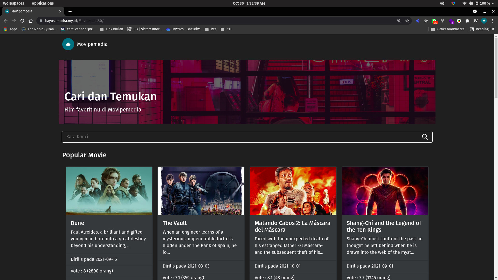

# Movipedia 2.0



Versi ini merupakan movipedia terbaru dengan memanfaatkan typescript. Live daro repo ini dapat anda lihat di [https://bayusamudra.my.id/Movipedia-2.0/](https://bayusamudra.my.id/Movipedia-2.0/).

## Cara Build

Pastikan anda telah set environtment variabel untuk API_TOKEN. API_TOKEN berisi token API anda untuk mengakses API [https://www.themoviedb.org/](https://www.themoviedb.org/).

```shell
npm install
npm run build
```

## Cara Run Development

Gunakan:

```shell
npm install
npm tun build
```
